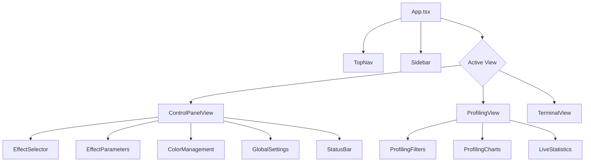
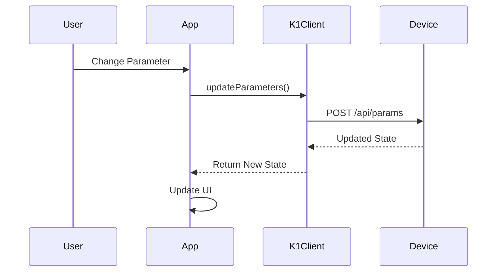
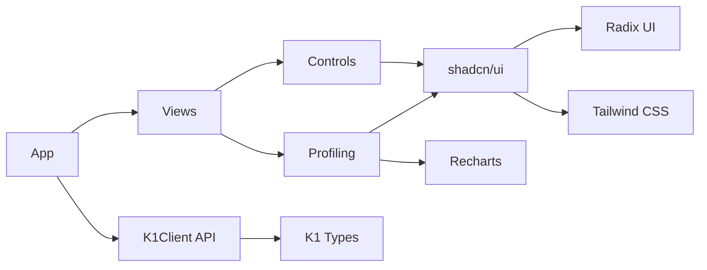

# Design Document: K1 Control App Architecture Documentation

## Overview

This design document outlines the comprehensive architectural documentation system for the K1 Control App. The documentation will serve as the definitive technical reference for developers, covering the React/TypeScript architecture, Vite build toolchain, component organization, and development workflows. The documentation will be delivered as a structured markdown file with embedded Mermaid diagrams for visual clarity.

## Architecture

### Documentation Structure

The architectural documentation will be organized into the following major sections:

1. **Executive Summary** - High-level overview and quick reference
2. **React/TypeScript Architecture** - Component hierarchy, state management, TypeScript configuration
3. **Build Toolchain** - Vite configuration, compilation pipeline, optimization strategies
4. **Supporting Infrastructure** - Dependencies, scripts, development tools
5. **Visual Diagrams** - Component trees, data flow, build process
6. **Development Workflows** - Common tasks, best practices, troubleshooting
7. **Optimization Opportunities** - Performance improvements, code quality enhancements

### Documentation Format

- **Primary Format**: Markdown (.md) for maximum portability and version control
- **Diagrams**: Mermaid syntax embedded in markdown
- **Code Examples**: Syntax-highlighted code blocks
- **Cross-References**: Internal links between sections
- **Table of Contents**: Auto-generated navigation structure

## Components and Interfaces

### 1. Executive Summary Component

**Purpose**: Provide quick orientation for developers

**Content Structure**:
```typescript
interface ExecutiveSummary {
  projectName: string;
  description: string;
  techStack: TechStackItem[];
  quickStart: QuickStartStep[];
  keyMetrics: ProjectMetrics;
}
```

**Key Information**:
- Project name and purpose
- Technology stack at a glance
- Quick start commands
- Directory structure overview
- Key architectural decisions

### 2. React/TypeScript Architecture Component

**Purpose**: Document the React application structure and TypeScript configuration

**Content Structure**:
```typescript
interface ReactArchitecture {
  componentHierarchy: ComponentTree;
  stateManagement: StateManagementStrategy;
  typeScriptConfig: TypeScriptConfiguration;
  reactVersion: string;
  dependencies: ReactDependency[];
}

interface ComponentTree {
  root: Component;
  children: ComponentTree[];
  props: PropDefinition[];
  state: StateDefinition[];
}
```

**Key Information**:
- Component hierarchy from App.tsx down
- State management approach (props drilling, no external state library)
- TypeScript compiler options and path aliases
- React 18.3.1 features in use
- Component organization patterns

**Component Categories**:
1. **Layout Components**: App, TopNav, Sidebar
2. **View Components**: ControlPanelView, ProfilingView, TerminalView
3. **Control Components**: EffectSelector, EffectParameters, ColorManagement, GlobalSettings, StatusBar
4. **Profiling Components**: ProfilingCharts, LiveStatistics, ProfilingFilters
5. **UI Primitives**: shadcn/ui components (Button, Card, Slider, etc.)
6. **API Layer**: K1Client, K1 data structures

### 3. Build Toolchain Component

**Purpose**: Document the Vite-based build system and compilation process

**Content Structure**:
```typescript
interface BuildToolchain {
  buildTool: 'Vite';
  version: string;
  plugins: VitePlugin[];
  configuration: ViteConfig;
  buildModes: BuildMode[];
  optimization: OptimizationStrategy;
}

interface ViteConfig {
  plugins: string[];
  resolve: ResolveConfig;
  build: BuildConfig;
  server: ServerConfig;
}
```

**Key Information**:
- Vite 6.4.1 configuration
- React SWC plugin for fast compilation
- Path aliases and module resolution
- Development server configuration (port 3000, HMR)
- Production build settings (ESNext target, output to /build)
- Extensive Radix UI alias mappings

**Build Modes**:
1. **Development**: `npm run dev` - HMR enabled, source maps, fast refresh
2. **Production**: `npm run build` - Minification, tree-shaking, optimization
3. **Preview**: `npm run preview` - Test production build locally
4. **Type Check**: `npm run type-check` - TypeScript validation without emit

### 4. Supporting Infrastructure Component

**Purpose**: Document testing, linting, dependencies, and development tools

**Content Structure**:
```typescript
interface SupportingInfrastructure {
  testing: TestingFramework | null;
  linting: LintingConfig | null;
  formatting: FormattingConfig | null;
  dependencies: DependencyManifest;
  cicd: CICDConfig | null;
}

interface DependencyManifest {
  runtime: Dependency[];
  development: Dependency[];
  peerDependencies: Dependency[];
}
```

**Key Information**:
- **Testing**: No testing framework currently configured
- **Linting**: No ESLint configuration detected
- **Formatting**: No Prettier configuration detected
- **Dependencies**: 
  - React 18.3.1 + React DOM
  - Radix UI component library (comprehensive set)
  - Lucide React icons
  - Recharts for data visualization
  - Tailwind CSS for styling
  - TypeScript 5.6.3
- **Dev Dependencies**:
  - Vite 6.4.1
  - @vitejs/plugin-react-swc
  - TypeScript
  - Tailwind CSS + PostCSS + Autoprefixer
- **CI/CD**: No pipeline configuration detected

### 5. Visual Diagrams Component

**Purpose**: Provide visual representations of architecture and workflows

**Diagram Types**:

#### 5.1 Component Hierarchy Diagram


#### 5.2 Data Flow Diagram


#### 5.3 Build Process Diagram
```mermaid
flowchart LR
    Source[Source Files] --> Vite[Vite]
    Vite --> SWC[SWC Compiler]
    SWC --> Transform[Transform JSX/TS]
    Transform --> Bundle[Bundle Modules]
    Bundle --> Optimize[Optimize]
    Optimize --> Output[/build Directory]
    
    style Vite fill:#646cff
    style Output fill:#34d399
```

#### 5.4 Module Dependency Graph


### 6. Development Workflows Component

**Purpose**: Document common development tasks and best practices

**Workflow Categories**:

#### 6.1 Environment Setup
```bash
# Clone repository
# Navigate to k1-control-app
cd k1-control-app

# Install dependencies
npm install

# Start development server
npm run dev

# Open browser to http://localhost:3000
```

#### 6.2 Component Development
1. Create component in appropriate directory
2. Define TypeScript interfaces for props
3. Import required UI primitives from shadcn/ui
4. Implement component logic
5. Export component
6. Import and use in parent component

#### 6.3 Adding New Dependencies
```bash
# Add runtime dependency
npm install <package>

# Add development dependency
npm install -D <package>

# Update package-lock.json
npm install
```

#### 6.4 Type Checking
```bash
# Run TypeScript compiler check
npm run type-check

# Fix type errors before committing
```

#### 6.5 Building for Production
```bash
# Create optimized production build
npm run build

# Test production build locally
npm run preview
```

### 7. Optimization Opportunities Component

**Purpose**: Identify areas for improvement and enhancement

**Optimization Categories**:

#### 7.1 Testing Infrastructure
**Current State**: No testing framework configured

**Recommendations**:
- Add Vitest for unit testing (Vite-native)
- Add React Testing Library for component testing
- Add Playwright for E2E testing
- Target: 80%+ code coverage for critical paths

**Implementation**:
```json
{
  "devDependencies": {
    "vitest": "^1.0.0",
    "@testing-library/react": "^14.0.0",
    "@testing-library/jest-dom": "^6.0.0",
    "@playwright/test": "^1.40.0"
  }
}
```

#### 7.2 Code Quality Tools
**Current State**: No linting or formatting configured

**Recommendations**:
- Add ESLint with React and TypeScript plugins
- Add Prettier for consistent formatting
- Add lint-staged and husky for pre-commit hooks
- Configure VS Code settings for auto-format on save

**Implementation**:
```json
{
  "devDependencies": {
    "eslint": "^8.0.0",
    "@typescript-eslint/parser": "^6.0.0",
    "@typescript-eslint/eslint-plugin": "^6.0.0",
    "eslint-plugin-react": "^7.33.0",
    "eslint-plugin-react-hooks": "^4.6.0",
    "prettier": "^3.0.0",
    "lint-staged": "^15.0.0",
    "husky": "^8.0.0"
  }
}
```

#### 7.3 State Management
**Current State**: Props drilling, no centralized state

**Recommendations**:
- Consider React Context for connection state
- Consider Zustand for global app state (lightweight)
- Avoid Redux (overkill for this app size)
- Implement custom hooks for shared logic

**Benefits**:
- Reduce prop drilling
- Centralize K1Client instance
- Simplify connection state management
- Improve component reusability

#### 7.4 Performance Optimizations
**Current State**: Basic React app, no specific optimizations

**Recommendations**:
- Add React.memo for expensive components
- Implement useMemo for expensive calculations
- Use useCallback for event handlers passed as props
- Add code splitting with React.lazy for views
- Optimize bundle size with tree-shaking analysis

**Implementation Example**:
```typescript
// Code splitting views
const ControlPanelView = lazy(() => import('./components/views/ControlPanelView'));
const ProfilingView = lazy(() => import('./components/views/ProfilingView'));
const TerminalView = lazy(() => import('./components/views/TerminalView'));

// Wrap in Suspense
<Suspense fallback={<LoadingSpinner />}>
  {activeView === 'control' && <ControlPanelView />}
</Suspense>
```

#### 7.5 Build Optimizations
**Current State**: Default Vite configuration

**Recommendations**:
- Enable build analysis with rollup-plugin-visualizer
- Configure chunk splitting strategy
- Optimize asset loading (lazy load images)
- Enable compression (gzip/brotli)
- Add source map configuration for production debugging

**Implementation**:
```typescript
// vite.config.ts additions
import { visualizer } from 'rollup-plugin-visualizer';

export default defineConfig({
  plugins: [
    react(),
    visualizer({ open: true })
  ],
  build: {
    rollupOptions: {
      output: {
        manualChunks: {
          'react-vendor': ['react', 'react-dom'],
          'ui-vendor': ['@radix-ui/react-*'],
          'chart-vendor': ['recharts']
        }
      }
    }
  }
});
```

#### 7.6 TypeScript Strictness
**Current State**: No tsconfig.json in k1-control-app directory

**Recommendations**:
- Create tsconfig.json with strict mode enabled
- Enable all strict type checking options
- Configure path aliases for cleaner imports
- Set up project references if needed

**Implementation**:
```json
{
  "compilerOptions": {
    "target": "ESNext",
    "lib": ["DOM", "DOM.Iterable", "ESNext"],
    "module": "ESNext",
    "moduleResolution": "bundler",
    "resolveJsonModule": true,
    "allowImportingTsExtensions": true,
    "strict": true,
    "noUnusedLocals": true,
    "noUnusedParameters": true,
    "noFallthroughCasesInSwitch": true,
    "jsx": "react-jsx",
    "paths": {
      "@/*": ["./src/*"],
      "@/components/*": ["./src/components/*"],
      "@/api/*": ["./src/api/*"],
      "@/types/*": ["./src/types/*"]
    }
  },
  "include": ["src"],
  "exclude": ["node_modules", "build"]
}
```

#### 7.7 Documentation
**Current State**: Basic README, DEVELOPMENT.md, DESIGN_SPECS.md

**Recommendations**:
- Add JSDoc comments to complex functions
- Create API documentation for K1Client
- Add component usage examples
- Create troubleshooting guide
- Document environment variables
- Add architecture decision records (ADRs)

#### 7.8 Developer Experience
**Current State**: Basic setup

**Recommendations**:
- Add VS Code workspace settings
- Create debug configurations
- Add recommended extensions list
- Set up GitHub Copilot/AI assistant configurations
- Create issue templates
- Add pull request template

## Data Models

### Documentation Data Model

```typescript
interface ArchitectureDocumentation {
  metadata: DocumentMetadata;
  executiveSummary: ExecutiveSummary;
  architecture: {
    react: ReactArchitecture;
    typescript: TypeScriptConfiguration;
    stateManagement: StateManagementStrategy;
  };
  buildToolchain: BuildToolchain;
  infrastructure: SupportingInfrastructure;
  diagrams: VisualDiagram[];
  workflows: DevelopmentWorkflow[];
  optimizations: OptimizationOpportunity[];
}

interface DocumentMetadata {
  title: string;
  version: string;
  lastUpdated: Date;
  authors: string[];
  reviewers: string[];
}

interface TechStackItem {
  name: string;
  version: string;
  purpose: string;
  category: 'framework' | 'library' | 'tool' | 'language';
}

interface ComponentTree {
  name: string;
  path: string;
  type: 'layout' | 'view' | 'control' | 'ui' | 'api';
  props: PropDefinition[];
  children: ComponentTree[];
  dependencies: string[];
}

interface PropDefinition {
  name: string;
  type: string;
  required: boolean;
  description: string;
}

interface StateManagementStrategy {
  approach: 'props' | 'context' | 'redux' | 'zustand' | 'other';
  description: string;
  stateLocations: StateLocation[];
}

interface StateLocation {
  component: string;
  stateVariables: StateVariable[];
}

interface StateVariable {
  name: string;
  type: string;
  purpose: string;
  scope: 'local' | 'shared';
}

interface BuildMode {
  name: string;
  command: string;
  description: string;
  features: string[];
}

interface OptimizationOpportunity {
  category: string;
  priority: 'high' | 'medium' | 'low';
  currentState: string;
  recommendation: string;
  implementation: string;
  benefits: string[];
  effort: 'low' | 'medium' | 'high';
}

interface DevelopmentWorkflow {
  name: string;
  description: string;
  steps: WorkflowStep[];
  prerequisites: string[];
  troubleshooting: TroubleshootingTip[];
}

interface WorkflowStep {
  order: number;
  action: string;
  command?: string;
  notes?: string;
}

interface TroubleshootingTip {
  problem: string;
  solution: string;
  relatedIssues: string[];
}
```

### Component Inventory Data Model

```typescript
interface ComponentInventory {
  totalComponents: number;
  componentsByCategory: Record<string, Component[]>;
  componentDependencies: DependencyGraph;
  sharedComponents: Component[];
}

interface Component {
  name: string;
  path: string;
  category: ComponentCategory;
  exports: Export[];
  imports: Import[];
  props: PropDefinition[];
  hooks: Hook[];
  complexity: ComplexityMetrics;
}

type ComponentCategory = 
  | 'layout'
  | 'view'
  | 'control'
  | 'profiling'
  | 'ui-primitive'
  | 'api'
  | 'utility';

interface Export {
  name: string;
  type: 'default' | 'named';
  kind: 'component' | 'function' | 'constant' | 'type';
}

interface Import {
  source: string;
  imports: string[];
  isExternal: boolean;
}

interface Hook {
  name: string;
  type: 'built-in' | 'custom';
  purpose: string;
}

interface ComplexityMetrics {
  linesOfCode: number;
  cyclomaticComplexity: number;
  dependencies: number;
  testCoverage?: number;
}

interface DependencyGraph {
  nodes: DependencyNode[];
  edges: DependencyEdge[];
}

interface DependencyNode {
  id: string;
  label: string;
  type: ComponentCategory;
}

interface DependencyEdge {
  from: string;
  to: string;
  type: 'imports' | 'renders' | 'calls';
}
```

## Error Handling

### Documentation Generation Errors

**Error Types**:
1. **Missing Files**: Required source files not found
2. **Parse Errors**: Unable to parse TypeScript/JSX
3. **Invalid Configuration**: Malformed config files
4. **Diagram Generation**: Mermaid syntax errors

**Error Handling Strategy**:
- Graceful degradation: Document what's available
- Clear error messages with file paths
- Suggestions for resolution
- Partial documentation generation when possible

### Documentation Validation

**Validation Checks**:
1. All referenced files exist
2. All code examples are syntactically valid
3. All Mermaid diagrams render correctly
4. All internal links resolve
5. No broken external links
6. Consistent formatting throughout

**Validation Process**:
```typescript
interface ValidationResult {
  isValid: boolean;
  errors: ValidationError[];
  warnings: ValidationWarning[];
}

interface ValidationError {
  type: string;
  message: string;
  location: string;
  severity: 'error' | 'warning';
}
```

## Testing Strategy

### Documentation Testing

**Test Categories**:

1. **Content Accuracy Tests**
   - Verify all file paths are correct
   - Verify all version numbers match package.json
   - Verify all code examples compile
   - Verify all commands execute successfully

2. **Diagram Tests**
   - Verify all Mermaid diagrams render
   - Verify diagram syntax is valid
   - Verify diagrams match actual architecture

3. **Link Tests**
   - Verify all internal links resolve
   - Verify all external links are accessible
   - Verify anchor links work correctly

4. **Format Tests**
   - Verify markdown syntax is valid
   - Verify code blocks have language tags
   - Verify consistent heading hierarchy
   - Verify table of contents is accurate

### Manual Review Checklist

- [ ] Executive summary is clear and concise
- [ ] Component hierarchy is complete and accurate
- [ ] Build process is fully documented
- [ ] All diagrams render correctly
- [ ] Code examples are tested and working
- [ ] Optimization recommendations are actionable
- [ ] Development workflows are step-by-step
- [ ] Troubleshooting tips are helpful
- [ ] Document is well-organized and navigable
- [ ] Technical accuracy verified by senior developer

## Implementation Approach

### Phase 1: Data Collection
1. Scan project directory structure
2. Parse package.json and vite.config.ts
3. Analyze component files for hierarchy
4. Extract TypeScript configurations
5. Identify dependencies and their purposes
6. Collect build scripts and commands

### Phase 2: Analysis
1. Build component dependency graph
2. Identify state management patterns
3. Analyze build configuration
4. Assess current tooling gaps
5. Identify optimization opportunities
6. Document architectural patterns

### Phase 3: Documentation Generation
1. Create markdown document structure
2. Generate executive summary
3. Document React/TypeScript architecture
4. Document build toolchain
5. Document supporting infrastructure
6. Create Mermaid diagrams
7. Document development workflows
8. Document optimization opportunities

### Phase 4: Review and Refinement
1. Validate all content
2. Test all code examples
3. Verify all diagrams render
4. Check all links
5. Review for clarity and completeness
6. Incorporate feedback
7. Finalize documentation

## Deliverables

### Primary Deliverable
**File**: `docs/architecture/K1_CONTROL_APP_ARCHITECTURE.md`

**Contents**:
- Complete architectural documentation
- Embedded Mermaid diagrams
- Code examples with syntax highlighting
- Development workflows
- Optimization recommendations
- Troubleshooting guides

### Supporting Deliverables
1. **Component Inventory**: Detailed list of all components
2. **Dependency Graph**: Visual representation of module dependencies
3. **Quick Reference Card**: One-page cheat sheet for common tasks
4. **Onboarding Checklist**: Step-by-step guide for new developers

### Documentation Maintenance

**Update Triggers**:
- Major dependency updates
- Architectural changes
- New features added
- Build process changes
- Performance optimizations implemented

**Maintenance Schedule**:
- Review quarterly
- Update after major releases
- Validate links monthly
- Refresh diagrams as needed

**Version Control**:
- Document version in metadata
- Track changes in git
- Maintain changelog section
- Archive old versions

## Success Criteria

The architectural documentation will be considered successful when:

1. **Completeness**: All six requirements are fully addressed
2. **Accuracy**: All technical information is correct and up-to-date
3. **Clarity**: Developers can understand the architecture without additional help
4. **Usability**: New developers can onboard using only the documentation
5. **Maintainability**: Documentation can be easily updated as the project evolves
6. **Visual Quality**: All diagrams render correctly and enhance understanding
7. **Actionability**: Optimization recommendations are specific and implementable

## Conclusion

This design provides a comprehensive blueprint for creating world-class architectural documentation for the K1 Control App. The documentation will serve as a living reference that grows with the project, ensuring that all developers have access to accurate, up-to-date information about the application's architecture, build process, and development workflows.
