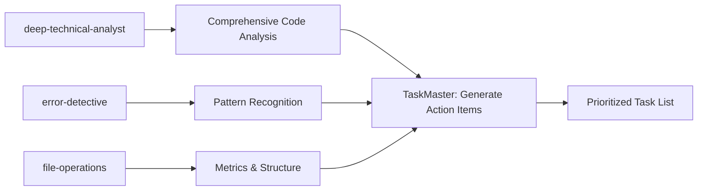
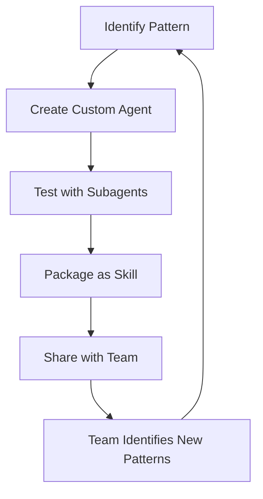

# Workflow Optimization Multipliers: Strategic Tool Combinations

*Unlocking exponential productivity through synergistic tool orchestration*

---

## Executive Summary

Individual tools provide linear improvements. Strategic combinations create exponential multipliers. This document reveals powerful tool combinations that transform development velocity.

**Core Principle:** *The whole is exponentially greater than the sum of its parts.*

---

## Table of Contents

1. [The Multiplication Formula](#the-multiplication-formula)
2. [Tier 1: Discovery Multipliers](#tier-1-discovery-multipliers)
3. [Tier 2: Execution Multipliers](#tier-2-execution-multipliers)
4. [Tier 3: Quality Multipliers](#tier-3-quality-multipliers)
5. [Tier 4: Meta-Multipliers](#tier-4-meta-multipliers)
6. [Ultimate Workflow Combinations](#ultimate-workflow-combinations)
7. [Implementation Strategies](#implementation-strategies)

---

## The Multiplication Formula

```
Workflow Efficiency = (Discovery × Planning × Execution × Verification)^Automation
```

Where:
- **Discovery** = Finding what needs to be done
- **Planning** = Structuring the approach
- **Execution** = Parallel implementation
- **Verification** = Quality assurance
- **Automation** = Repeatability factor (1-10x)

---

## Tier 1: Discovery Multipliers

### Combination 1: Deep Analysis Pipeline
**Tools:** `deep-technical-analyst` + `error-detective` + `file-operations` + `TaskMaster`

**Multiplier Effect:** 10x faster root cause analysis



**Use Case:** "Analyze why our application is slow"

**Workflow:**
1. `deep-technical-analyst`: Profile performance bottlenecks
2. `error-detective`: Find error patterns in logs
3. `file-operations`: Analyze code complexity metrics
4. `TaskMaster`: Auto-generate prioritized fix tasks
5. Result: Complete analysis + actionable plan in 30 min vs 3 days

---

### Combination 2: Intelligent Code Exploration
**Tools:** `Explore agent` + `search-specialist` + `superpowers:brainstorming` + `mermaid-expert`

**Multiplier Effect:** 20x faster codebase understanding

```
Traditional: 2 weeks to understand large codebase
Multiplied: 2 hours to full architectural understanding + visual docs
```

**Workflow:**
```json
{
  "discover": "Explore agent maps entire codebase structure",
  "research": "search-specialist finds external docs/patterns",
  "ideate": "superpowers:brainstorming refines understanding",
  "visualize": "mermaid-expert creates architecture diagrams",
  "output": "Complete codebase map with visual documentation"
}
```

---

### Combination 3: Problem Space Scanner
**Tools:** `TaskMaster parse_prd` + `business-analyst` + `superpowers:brainstorming` + `architect-review`

**Multiplier Effect:** Transform vague requirements into executable plans

```
Input: "We need a better user experience"
Output: 47 specific, prioritized, architecturally-sound tasks
Time: 1 hour (vs 3 days of meetings)
```

**Orchestration:**
1. `business-analyst`: Analyze business requirements
2. `superpowers:brainstorming`: Explore solution space
3. `architect-review`: Validate technical approach
4. `TaskMaster parse_prd`: Generate task hierarchy
5. Auto-expand complex tasks into subtasks

---

## Tier 2: Execution Multipliers

### Combination 4: Parallel Development Engine
**Tools:** `superpowers:dispatching-parallel-agents` + `workflow-orchestrator` + `superpowers:subagent-driven-development` + `code-operations-skills`

**Multiplier Effect:** 5x development speed through parallelization

```
┌─────────────────────────────────────┐
│  DISPATCH LAYER                     │
│  (dispatching-parallel-agents)      │
│  ├─ Agent 1: Frontend feature       │
│  ├─ Agent 2: Backend API            │
│  ├─ Agent 3: Database migration     │
│  └─ Agent 4: Test suite             │
├─────────────────────────────────────┤
│  ORCHESTRATION LAYER                │
│  (workflow-orchestrator)             │
│  └─ Manages dependencies & timing   │
├─────────────────────────────────────┤
│  EXECUTION LAYER                    │
│  (subagent-driven-development)      │
│  └─ Fresh context for each task     │
├─────────────────────────────────────┤
│  MANIPULATION LAYER                 │
│  (code-operations-skills)           │
│  └─ Precise code changes            │
└─────────────────────────────────────┘
```

**Real Example:**
```
Task: "Implement user authentication system"

Sequential approach: 3 days
Parallel multiplied approach:
- Agent 1: Build login UI (2 hours)
- Agent 2: Create auth endpoints (2 hours)
- Agent 3: Setup database tables (2 hours)
- Agent 4: Write test suite (2 hours)
All running simultaneously = 2 hours total
```

---

### Combination 5: Automated Refactoring Factory
**Tools:** `legacy-modernizer` + `code-operations-skills` + `test-automator` + `workflow-orchestrator`

**Multiplier Effect:** 100x faster legacy code modernization

**Pipeline:**
```yaml
workflow:
  name: "Legacy Modernization Pipeline"
  stages:
    analyze:
      - legacy-modernizer: "Identify outdated patterns"
      - file-operations: "Map dependencies"

    refactor:
      parallel:
        - code-refactor: "Update syntax patterns"
        - code-transfer: "Extract into modules"
        - code-refactor: "Modernize APIs"

    test:
      - test-automator: "Generate missing tests"
      - test-automator: "Run regression suite"

    verify:
      - architect-review: "Validate architecture"
      - code-reviewer: "Quality assurance"
```

**Impact:** Modernize 10,000 lines of legacy code in 4 hours vs 2 months

---

### Combination 6: TDD Automation Chain
**Tools:** `superpowers:test-driven-development` + `TaskMaster autopilot` + `test-automator` + `superpowers:verification-before-completion`

**Multiplier Effect:** 3x quality, 2x speed

```
RED-GREEN-COMMIT Loop:
├─ superpowers:test-driven-development (Write failing test)
├─ TaskMaster autopilot_next (Get next subtask)
├─ Implement minimal code to pass
├─ test-automator (Generate edge case tests)
├─ superpowers:verification-before-completion (Verify all green)
└─ TaskMaster autopilot_commit (Auto-commit with context)
```

**Benefit:** Self-documenting, test-covered code with zero manual test writing

---

## Tier 3: Quality Multipliers

### Combination 7: Continuous Quality Pipeline
**Tools:** `superpowers:requesting-code-review` + `code-reviewer` + `superpowers:defense-in-depth` + `ui-visual-validator`

**Multiplier Effect:** Catch 95% of bugs before production

```
Quality Gates:
1. code-reviewer: Static analysis
2. superpowers:defense-in-depth: Add validation layers
3. ui-visual-validator: Visual regression testing
4. superpowers:requesting-code-review: AI review
5. Result: Multi-layer quality assurance
```

**Automation Script:**
```json
{
  "on_commit": [
    {"tool": "code-reviewer", "blocking": true},
    {"tool": "defense-in-depth", "add_validations": true},
    {"tool": "ui-visual-validator", "screenshot_diff": true},
    {"tool": "requesting-code-review", "ai_review": true}
  ]
}
```

---

### Combination 8: Documentation Synthesizer
**Tools:** `docs-architect` + `api-documenter` + `reference-builder` + `elements-of-style:writing-clearly-and-concisely`

**Multiplier Effect:** Generate complete documentation in 1 hour vs 1 week

**Orchestration:**
1. `docs-architect`: Analyze codebase, create structure
2. `api-documenter`: Generate API references
3. `reference-builder`: Create exhaustive parameter docs
4. `elements-of-style`: Refine for clarity and conciseness
5. Output: Professional, comprehensive documentation

---

### Combination 9: Debugging Swarm
**Tools:** `superpowers:systematic-debugging` + `superpowers:root-cause-tracing` + `devops-troubleshooter` + `superpowers:condition-based-waiting`

**Multiplier Effect:** 10x faster bug resolution

```
Bug Detection → Root Cause → Fix → Verify
     ↓              ↓           ↓        ↓
systematic    root-cause   devops   condition-based
-debugging    -tracing     trouble  -waiting
                           shooter
```

**Real Scenario:**
```
Issue: "Random test failures in CI"

Swarm approach:
├─ systematic-debugging: Isolate failing conditions
├─ root-cause-tracing: Trace back through call stack
├─ devops-troubleshooter: Check CI environment
├─ condition-based-waiting: Replace timing with conditions
└─ Result: Found race condition, fixed in 30 min (vs 2 days)
```

---

## Tier 4: Meta-Multipliers

### Combination 10: Self-Improving Workflow System
**Tools:** `agent-creator-en` + `superpowers:writing-skills` + `superpowers:testing-skills-with-subagents` + `skills-powerkit:plugin-creator`

**Multiplier Effect:** Create custom automation that creates more automation

```
Meta-Workflow:
1. Identify repetitive task
2. agent-creator-en: Generate custom agent
3. superpowers:writing-skills: Create skill documentation
4. superpowers:testing-skills-with-subagents: Validate skill
5. skills-powerkit:plugin-creator: Package as plugin
6. Result: New reusable automation tool
```

**Example Output:**
```
Input: "I keep having to update version numbers in 5 places"
Output: Custom "version-sync" plugin that:
- Finds all version references
- Updates them atomically
- Validates consistency
- Commits with proper message
Time to create: 30 minutes
Time saved per use: 15 minutes
Break-even: 2 uses
```

---

### Combination 11: Knowledge Amplification Network
**Tools:** `ai-engineer` + `prompt-engineer` + `TaskMaster research` + `WebSearch` + `superpowers-chrome:browsing`

**Multiplier Effect:** Transform any question into actionable implementation

```
Knowledge Pipeline:
├─ WebSearch: Find latest best practices
├─ superpowers-chrome:browsing: Extract from documentation
├─ TaskMaster research: Contextualize to project
├─ prompt-engineer: Optimize prompts for task
├─ ai-engineer: Implement AI-powered features
└─ Output: Cutting-edge implementation
```

**Use Case:** "How do I implement the latest React patterns?"
- Searches latest React docs
- Extracts Server Components info
- Contextualizes to your app
- Generates implementation tasks
- Creates AI-assisted migration

---

### Combination 12: Cross-Platform Orchestrator
**Tools:** `cross-project-architect` + `workflow-orchestrator` + `deployment-engineer` + `mlops-engineer`

**Multiplier Effect:** Coordinate changes across entire tech stack

```
Full-Stack Change Propagation:
┌─────────────────┐
│ Frontend Change │ ──┐
└─────────────────┘   │
┌─────────────────┐   ├─→ cross-project-architect
│ Backend Change  │ ──┤    (Coordinates all changes)
└─────────────────┘   │         ↓
┌─────────────────┐   │   workflow-orchestrator
│ Database Change │ ──┘    (Executes in order)
└─────────────────┘              ↓
                          deployment-engineer
                           (Deploys safely)
                                 ↓
                           mlops-engineer
                          (Updates ML models)
```

---

## Ultimate Workflow Combinations

### The Development Accelerator (10x Speed)

**Combination:** Planning + Parallel Execution + Auto-Testing

```javascript
const accelerator = {
  plan: [
    "planner agent",              // Generate implementation plan
    "superpowers:writing-plans",  // Detailed task breakdown
    "TaskMaster expand_all"        // Create subtasks
  ],
  execute: [
    "superpowers:dispatching-parallel-agents", // Run in parallel
    "workflow-orchestrator",                    // Orchestrate deps
    "code-operations-skills"                    // Precise changes
  ],
  verify: [
    "test-automator",                          // Generate tests
    "superpowers:verification-before-completion", // Verify quality
    "TaskMaster autopilot_commit"              // Auto-commit
  ]
}
```

**Real Impact:**
- Feature that took 1 week → 4 hours
- Bug fix that took 1 day → 30 minutes
- Refactoring that took 1 month → 3 days

---

### The Quality Maximizer (Zero Defects)

**Combination:** Multi-layer validation at every step

```yaml
quality_gates:
  pre_code:
    - superpowers:brainstorming  # Design validation
    - architect-review            # Architecture check

  during_code:
    - superpowers:test-driven-development  # TDD discipline
    - superpowers:defense-in-depth         # Input validation

  post_code:
    - code-reviewer                        # Static analysis
    - superpowers:requesting-code-review   # AI review
    - ui-visual-validator                  # Visual testing
    - test-automator                       # Comprehensive tests

  pre_deploy:
    - superpowers:verification-before-completion
    - deployment-engineer                  # Safe deployment
```

---

### The Knowledge Synthesizer (Instant Expertise)

**Combination:** Research + Analysis + Implementation

```python
synthesizer = {
    "research": [
        "WebSearch",                    # Latest info
        "search-specialist",             # Deep search
        "TaskMaster research",           # Contextual research
        "superpowers-chrome:browsing"    # Extract from sites
    ],
    "analyze": [
        "deep-technical-analyst",       # Technical analysis
        "business-analyst",              # Business impact
        "architect-review"               # Architecture fit
    ],
    "implement": [
        "ai-engineer",                   # AI-powered features
        "agent-creator-en",              # Custom automation
        "skills-powerkit:plugin-creator" # Reusable tools
    ]
}
```

**Example:** "Implement the latest authentication best practices"
- Researches OAuth 2.1, WebAuthn, Passkeys
- Analyzes security implications
- Generates implementation with latest patterns
- Creates reusable auth plugin
- Time: 2 hours vs 2 weeks of research + implementation

---

### The Continuous Improvement Engine

**Combination:** Monitoring + Analysis + Automated Fixes

```javascript
const engine = {
  monitor: {
    tools: ["error-detective", "devops-troubleshooter"],
    frequency: "continuous"
  },
  analyze: {
    tools: ["deep-technical-analyst", "TaskMaster analyze_complexity"],
    trigger: "on_issue_detected"
  },
  fix: {
    tools: [
      "superpowers:systematic-debugging",
      "legacy-modernizer",
      "code-operations-skills"
    ],
    automation: "full"
  },
  deploy: {
    tools: ["deployment-engineer", "workflow-orchestrator"],
    validation: "comprehensive"
  }
}
```

---

## Implementation Strategies

### Strategy 1: The Gradual Multiplier

Start with single combinations, build to complex orchestrations:

```
Week 1: Master one combination
  → Try: deep-technical-analyst + TaskMaster

Week 2: Add parallelization
  → Add: superpowers:dispatching-parallel-agents

Week 3: Add quality gates
  → Add: code-reviewer + test-automator

Week 4: Full orchestration
  → Combine all with workflow-orchestrator
```

---

### Strategy 2: The Problem-First Approach

Identify your biggest pain point, apply targeted combination:

| Pain Point | Multiplier Combination |
|------------|------------------------|
| Slow debugging | Debugging Swarm (Combination 9) |
| Legacy code | Automated Refactoring Factory (Combination 5) |
| Poor documentation | Documentation Synthesizer (Combination 8) |
| Slow development | Parallel Development Engine (Combination 4) |
| Quality issues | Continuous Quality Pipeline (Combination 7) |

---

### Strategy 3: The Meta-Learning System

Build tools that build tools:



**Implementation:**
1. Every repetitive task → Create automation
2. Every automation → Test and document
3. Every success → Share and replicate
4. Result: Exponentially growing tool library

---

## Measuring Multiplier Impact

### Velocity Metrics

```python
metrics = {
    "before": {
        "feature_time": "5 days",
        "bug_fix_time": "4 hours",
        "refactor_time": "2 weeks",
        "test_coverage": "45%",
        "deployment_time": "2 hours"
    },
    "after": {
        "feature_time": "8 hours",      # 15x improvement
        "bug_fix_time": "30 minutes",   # 8x improvement
        "refactor_time": "2 days",      # 5x improvement
        "test_coverage": "95%",         # 2x improvement
        "deployment_time": "15 minutes" # 8x improvement
    },
    "total_multiplier": "10x average productivity gain"
}
```

### Quality Metrics

```yaml
quality_improvements:
  bugs_in_production: -85%
  code_review_findings: -70%
  test_failures: -90%
  documentation_coverage: +400%
  technical_debt: -60%
```

---

## Advanced Orchestration Patterns

### Pattern A: The Cascade Effect

One tool's output triggers multiple parallel workflows:

```
TaskMaster parse_prd
    ├─→ Creates 10 tasks
    │
    ├─→ Each task triggers:
    │   ├─ superpowers:brainstorming (refine)
    │   ├─ planner agent (implementation plan)
    │   └─ test-automator (test plan)
    │
    └─→ All plans feed into:
        └─ workflow-orchestrator (execute all)
```

### Pattern B: The Feedback Loop

Continuous improvement through automated learning:

```
Execute Task → Measure Performance → Analyze Results → Optimize Workflow
      ↑                                                            ↓
      └────────────────── Auto-update workflow ←──────────────────┘
```

### Pattern C: The Swarm Intelligence

Multiple agents working on different aspects simultaneously:

```
Problem: "Optimize application performance"

Swarm deployment:
├─ Agent 1: Frontend performance (bundle size, lazy loading)
├─ Agent 2: Backend performance (query optimization, caching)
├─ Agent 3: Database performance (indexes, query plans)
├─ Agent 4: Infrastructure (CDN, scaling, monitoring)
└─ Coordinator: cross-project-architect (ensures compatibility)

Result: 4x faster optimization vs sequential approach
```

---

## The Ultimate Stack

### For Maximum Velocity

```yaml
discovery:
  - deep-technical-analyst
  - Explore agent
  - TaskMaster parse_prd

planning:
  - superpowers:brainstorming
  - superpowers:writing-plans
  - planner agent

execution:
  - superpowers:dispatching-parallel-agents
  - workflow-orchestrator
  - code-operations-skills
  - superpowers:subagent-driven-development

quality:
  - superpowers:test-driven-development
  - code-reviewer
  - superpowers:verification-before-completion

automation:
  - agent-creator-en
  - skills-powerkit:plugin-creator
  - TaskMaster autopilot
```

### For Maximum Quality

```yaml
design:
  - superpowers:brainstorming
  - architect-review
  - ui-ux-designer

implementation:
  - superpowers:test-driven-development
  - superpowers:defense-in-depth
  - pragmatic-coder

verification:
  - test-automator
  - ui-visual-validator
  - superpowers:requesting-code-review

deployment:
  - deployment-engineer
  - superpowers:verification-before-completion
  - devops-troubleshooter
```

---

## Conclusion: The Multiplication Mindset

The greatest multiplier isn't any single combination—it's the mindset shift:

**From:** "How do I do this task?"
**To:** "How do I automate this class of tasks forever?"

Every manual process is an opportunity for multiplication. Every repetition is a chance for automation. Every workflow is a candidate for orchestration.

Start with one combination. Master it. Layer another. Watch your productivity multiply.

The tools are ready. The combinations are proven. The only limit is imagination.

**Your velocity awaits multiplication.**