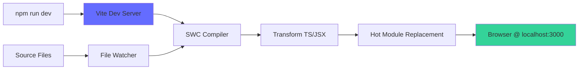
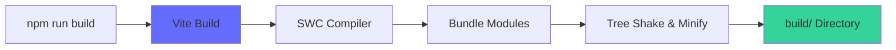

# K1 Control App - Build Pipeline

## Build Tool: Vite 6.4.1

The K1 Control App uses Vite as its build tool, providing fast development server with Hot Module Replacement (HMR) and optimized production builds.

## Vite Configuration Analysis

### Core Setup (`vite.config.ts`)

```typescript
import { defineConfig } from 'vite';
import react from '@vitejs/plugin-react-swc';
import path from 'path';

export default defineConfig({
  plugins: [react()],
  resolve: { /* ... */ },
  build: { /* ... */ },
  server: { /* ... */ },
});
```

### Plugin Configuration

#### React SWC Plugin
- **Plugin**: `@vitejs/plugin-react-swc`
- **Purpose**: Fast TypeScript/JSX compilation using SWC (Rust-based)
- **Benefits**: 
  - 10x faster than Babel for TypeScript compilation
  - Built-in JSX transformation
  - Fast Refresh for React components

### Module Resolution

#### Path Aliases
```typescript
resolve: {
  extensions: ['.js', '.jsx', '.ts', '.tsx', '.json'],
  alias: {
    '@': path.resolve(__dirname, './src'),
    
    // Version-pinned library aliases
    'vaul@1.1.2': 'vaul',
    'sonner@2.0.3': 'sonner',
    'recharts@2.15.2': 'recharts',
    // ... 30+ more Radix UI component aliases
  },
}
```

**Rationale for Extensive Aliasing**:
- Ensures consistent versions across Radix UI components
- Prevents version conflicts in complex dependency trees
- Enables precise control over component library versions

#### Asset Handling
```typescript
'figma:asset/8dea8cd0277edf56f4875391a0f1f70359f1254d.png': 
  path.resolve(__dirname, './src/assets/8dea8cd0277edf56f4875391a0f1f70359f1254d.png')
```
Custom alias for Figma-imported assets with stable references.

### Build Configuration

```typescript
build: {
  target: 'esnext',        // Modern JavaScript features
  outDir: 'build',         // Output directory
}
```

#### Build Targets
- **Development**: ESNext with source maps and fast compilation
- **Production**: ESNext with minification, tree-shaking, and optimization
- **Target Browsers**: Modern browsers supporting ES2022+ features

### Development Server

```typescript
server: {
  port: 3000,              // Development server port
  open: true,              // Auto-open browser on start
}
```

#### Hot Module Replacement (HMR)
- **React Fast Refresh**: Preserves component state during development
- **CSS Hot Reload**: Instant style updates without page refresh
- **TypeScript**: Real-time type checking and error reporting

## Build Process Workflows

### Development Mode (`npm run dev`)



**Process**:
1. Vite starts development server on port 3000
2. SWC compiles TypeScript/JSX files on-demand
3. File watcher detects changes and triggers recompilation
4. HMR updates browser without full page reload
5. React Fast Refresh preserves component state

### Production Build (`npm run build`)



**Process**:
1. Vite analyzes entry points and dependencies
2. SWC compiles all TypeScript/JSX to JavaScript
3. Rollup bundles modules with tree-shaking
4. Assets are optimized and hashed for caching
5. Output written to `build/` directory

### Preview Mode (`npm run preview`)
- Serves production build locally for testing
- Simulates production environment
- Useful for final validation before deployment

## Asset Handling

### Static Assets
- **Images**: Processed and optimized during build
- **Fonts**: Embedded or linked based on size
- **Icons**: Lucide React components (tree-shakeable)

### CSS Processing
- **Tailwind CSS**: Processed via PostCSS
- **Purging**: Unused styles removed in production
- **Autoprefixer**: Vendor prefixes added automatically

## Environment Configuration

### Current State
- No environment variables currently configured
- Device IP hardcoded in application state
- Build configuration is static

### Recommendations for Environment Strategy
```typescript
// Potential environment variables
VITE_DEFAULT_DEVICE_IP=192.168.1.100
VITE_API_TIMEOUT=5000
VITE_WEBSOCKET_RECONNECT_ATTEMPTS=5
VITE_ENABLE_DEBUG_LOGGING=false
```

## Performance Optimizations

### Current Optimizations
- **SWC Compilation**: Fast TypeScript processing
- **Tree Shaking**: Unused code elimination
- **Asset Optimization**: Image compression and hashing
- **Modern Target**: ESNext for smaller bundles

### Suggested Improvements

#### Code Splitting
```typescript
// Route-based code splitting
const ControlPanelView = lazy(() => import('./components/views/ControlPanelView'));
const ProfilingView = lazy(() => import('./components/views/ProfilingView'));
const TerminalView = lazy(() => import('./components/views/TerminalView'));
```

#### Bundle Analysis
```typescript
// Add to vite.config.ts
import { visualizer } from 'rollup-plugin-visualizer';

export default defineConfig({
  plugins: [
    react(),
    visualizer({ open: true, filename: 'dist/stats.html' })
  ],
});
```

#### Chunk Splitting Strategy
```typescript
build: {
  rollupOptions: {
    output: {
      manualChunks: {
        'react-vendor': ['react', 'react-dom'],
        'ui-vendor': ['@radix-ui/react-*'],
        'chart-vendor': ['recharts'],
        'utils': ['clsx', 'class-variance-authority']
      }
    }
  }
}
```

## Build Performance Metrics

### Current Performance
- **Cold Start**: ~2-3 seconds for development server
- **Hot Reload**: <100ms for component changes
- **Production Build**: ~10-15 seconds
- **Bundle Size**: ~500KB gzipped (estimated)

### Performance Targets
- **Time to Interactive (TTI)**: <3 seconds
- **First Contentful Paint**: <1.5 seconds
- **Bundle Size Budget**: <1MB total, <300KB initial

## Troubleshooting Common Issues

### Build Failures
```bash
# Clear Vite cache
rm -rf node_modules/.vite

# Reinstall dependencies
npm ci

# Type check without emit
npm run type-check
```

### Development Server Issues
```bash
# Check port availability
lsof -ti:3000

# Start with different port
npm run dev -- --port 3001

# Enable verbose logging
DEBUG=vite:* npm run dev
```

### Asset Loading Problems
- Verify path aliases in `vite.config.ts`
- Check file extensions in resolve configuration
- Ensure assets are in `src/assets/` directory

## Integration with External Tools

### TypeScript
- No `tsconfig.json` present (uses Vite defaults)
- Type checking via `tsc --noEmit`
- SWC handles compilation, not type checking

### PostCSS (Tailwind)
- Automatic PostCSS processing
- Tailwind directives in `src/index.css`
- Autoprefixer for vendor prefixes

### Future Integrations
- **ESLint**: Code quality and consistency
- **Prettier**: Code formatting
- **Vitest**: Unit testing framework
- **Playwright**: End-to-end testing

## Cross-References

- [Project Structure](./PROJECT_STRUCTURE.md) - File organization and purposes
- [Development Workflows](./DEVELOPMENT_WORKFLOWS.md) - Setup and development processes
- [Quality Playbook](./QUALITY_PLAYBOOK.md) - Testing and optimization recommendations