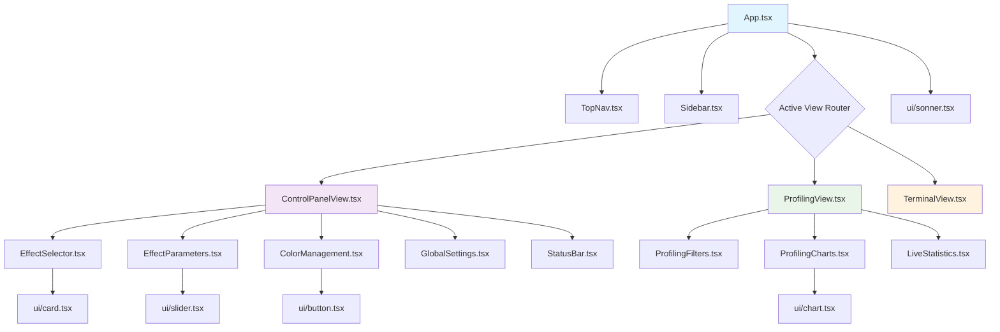
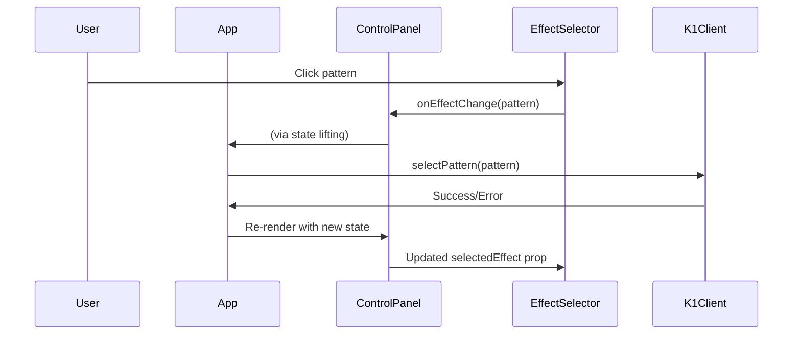
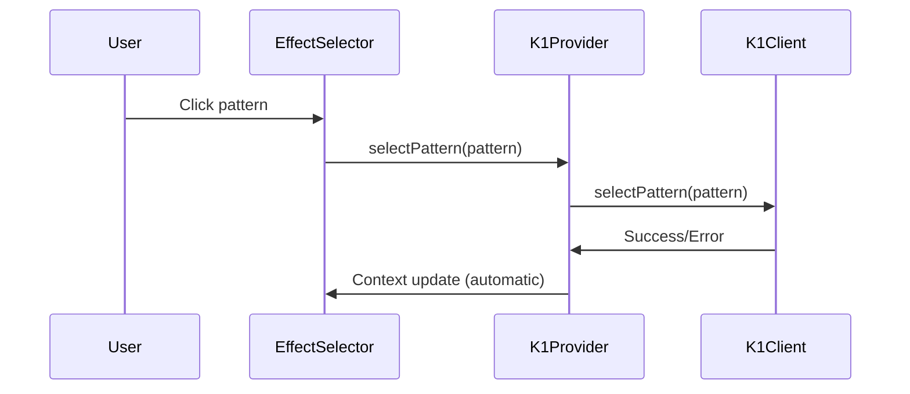

# K1 Control App - Component Hierarchy

## Component Tree Structure



## Component Responsibilities and Data Boundaries

### Root Level Components

#### App.tsx (Root Container)
**Responsibilities**:
- Application state management (connection, active view)
- K1Client lifecycle management
- View routing logic
- Global error boundaries (future)

**State Managed**:
```typescript
interface AppState {
  activeView: ViewType;
  connectionStatus: ConnectionStatus;
  connectionIP: string;
  k1Client: K1Client | null;
}
```

**Props Passed Down**:
- `isConnected: boolean` → All views
- `k1Client: K1Client | null` → Views that need device communication
- `activeView` & `onViewChange` → TopNav
- Connection state → Sidebar

#### TopNav.tsx (Navigation Bar)
**Responsibilities**:
- View tab navigation
- Connection status display
- Global actions (settings, help)

**Props Received**:
```typescript
interface TopNavProps {
  activeView: ViewType;
  onViewChange: (view: ViewType) => void;
  isConnected: boolean;
  connectionIP: string;
}
```

**Internal State**: None (stateless component)

#### Sidebar.tsx (Connection Panel)
**Responsibilities**:
- Device connection management
- IP address input and validation
- Connection status feedback
- Quick action buttons

**Props Received**:
```typescript
interface SidebarProps {
  isConnected: boolean;
  connectionStatus: ConnectionStatus;
  onConnect: () => void;
  connectionIP: string;
  onIPChange: (ip: string) => void;
}
```

**Internal State**:
- Form validation state
- Loading states for actions
- Serial port selection

### View Level Components

#### ControlPanelView.tsx (Main Control Interface)
**Responsibilities**:
- Layout of control components
- Coordination between pattern/parameter/palette controls
- Local state for selected effect

**Props Received**:
```typescript
interface ControlPanelViewProps {
  isConnected: boolean;
  k1Client: K1Client | null;
}
```

**Internal State**:
```typescript
const [selectedEffect, setSelectedEffect] = useState<EffectType>('analog');
```

**Data Flow**:
- Passes `selectedEffect` to EffectParameters
- Passes `isConnected` to all child controls
- Passes `k1Client` to components that need device communication

#### ProfilingView.tsx (Performance Dashboard)
**Responsibilities**:
- Performance data visualization layout
- Coordination between filters, charts, and statistics
- Data refresh management

**Props Received**:
```typescript
interface ProfilingViewProps {
  isConnected: boolean;
  k1Client: K1Client | null;
}
```

**Internal State**:
- Filter settings
- Chart data and refresh intervals
- View preferences

#### TerminalView.tsx (Debug Interface)
**Responsibilities**:
- Terminal output display
- Command input handling
- Command history management

**Props Received**:
```typescript
interface TerminalViewProps {
  isConnected: boolean;
  k1Client: K1Client | null;
}
```

**Internal State**:
- Terminal output buffer
- Command history
- Input state

### Control Components (ControlPanelView Children)

#### EffectSelector.tsx (Pattern Selection)
**Responsibilities**:
- Display available patterns in categorized grid
- Handle pattern selection
- Show pattern metadata (description, audio-reactive status)

**Props Received**:
```typescript
interface EffectSelectorProps {
  selectedEffect: EffectType;
  onEffectChange: (effect: EffectType) => void;
  disabled: boolean;
}
```

**Internal State**:
- Hover states
- Loading states for pattern switching

**Data Sources**:
- Static pattern data from `k1-data.ts`
- Pattern categories and metadata

#### EffectParameters.tsx (Real-time Controls)
**Responsibilities**:
- Parameter sliders (brightness, speed, saturation, etc.)
- Real-time parameter updates
- Parameter persistence per pattern
- Reset to defaults functionality

**Props Received**:
```typescript
interface EffectParametersProps {
  selectedEffect: EffectType;
  disabled: boolean;
}
```

**Internal State**:
- Parameter values
- Sync status indicators
- Debounced update timers

**Future Enhancement**: Should receive `k1Client` for direct parameter updates

#### ColorManagement.tsx (Palette Controls)
**Responsibilities**:
- Palette selection grid
- Manual HSV color controls
- Color preview and hex display

**Props Received**:
```typescript
interface ColorManagementProps {
  disabled: boolean;
}
```

**Internal State**:
- Selected palette
- Manual color values
- Color picker state

#### GlobalSettings.tsx (Device-wide Settings)
**Responsibilities**:
- Global brightness control
- Blur and softness settings
- Gamma correction toggle
- Warmth/color temperature

**Props Received**:
```typescript
interface GlobalSettingsProps {
  disabled: boolean;
}
```

**Internal State**:
- Global setting values
- Warning states for extreme values

#### StatusBar.tsx (Performance Metrics)
**Responsibilities**:
- FPS display with color-coded status
- CPU usage visualization
- Memory usage monitoring
- Connection latency display

**Props Received**:
```typescript
interface StatusBarProps {
  isConnected: boolean;
}
```

**Internal State**:
- Performance metrics
- Update intervals
- Threshold warnings

### Profiling Components (ProfilingView Children)

#### ProfilingFilters.tsx (Data Filtering)
**Responsibilities**:
- Time range selection
- Effect filtering
- Export controls
- Update rate configuration

**Internal State**:
- Filter settings
- Export options

#### ProfilingCharts.tsx (Data Visualization)
**Responsibilities**:
- FPS over time chart
- Frame time breakdown
- CPU usage by effect
- Memory usage trends

**Internal State**:
- Chart data buffers
- Zoom/pan state
- Chart configuration

#### LiveStatistics.tsx (Real-time Metrics)
**Responsibilities**:
- Live metrics table
- Trend indicators
- Threshold alerts

**Internal State**:
- Metrics data
- Sort/filter preferences
- Alert states

## Data Flow Patterns

### Current Data Flow (Props Drilling)



### Proposed Data Flow (K1Provider)



## Component Communication Patterns

### Current Patterns

1. **Parent-Child Props**: Direct prop passing for simple data
2. **Callback Props**: Event handlers passed down for user actions
3. **State Lifting**: Shared state managed in common ancestor
4. **Prop Drilling**: Deep prop passing through intermediate components

### Proposed Improvements

1. **Context Providers**: Shared state via React Context
2. **Custom Hooks**: Reusable state logic (useK1, useParameters)
3. **Event Emitters**: Decoupled component communication
4. **State Machines**: Predictable state transitions

## Component Optimization Opportunities

### Performance Issues

1. **Unnecessary Re-renders**: Components re-render when unrelated state changes
2. **Prop Drilling Overhead**: Deep prop passing creates coupling
3. **State Duplication**: Similar state managed in multiple components
4. **Missing Memoization**: Expensive computations recalculated on every render

### Optimization Strategies

#### React.memo for Pure Components
```typescript
export const EffectSelector = React.memo<EffectSelectorProps>(({ 
  selectedEffect, 
  onEffectChange, 
  disabled 
}) => {
  // Component implementation
});
```

#### useMemo for Expensive Computations
```typescript
const filteredPatterns = useMemo(() => {
  return patterns.filter(pattern => 
    pattern.category === selectedCategory
  );
}, [patterns, selectedCategory]);
```

#### useCallback for Stable Event Handlers
```typescript
const handlePatternSelect = useCallback((patternId: number) => {
  onEffectChange(patternId);
}, [onEffectChange]);
```

### Component Splitting Opportunities

#### Large Components to Split
1. **ControlPanelView**: Could be split into sections
2. **ProfilingCharts**: Each chart type could be separate component
3. **Sidebar**: Connection and actions could be separate

#### Reusable Component Extraction
1. **ParameterSlider**: Reusable slider with label and value display
2. **StatusIndicator**: Reusable connection/status display
3. **MetricCard**: Reusable metric display with trend

## Testing Strategy by Component Type

### Layout Components (App, Views)
- **Integration Tests**: Full user workflows
- **Routing Tests**: View switching behavior
- **State Tests**: State management and prop passing

### Control Components
- **Unit Tests**: Individual component behavior
- **Interaction Tests**: User input handling
- **API Tests**: Device communication (mocked)

### UI Components
- **Snapshot Tests**: Visual regression testing
- **Accessibility Tests**: ARIA attributes and keyboard navigation
- **Props Tests**: All prop combinations

## Future Architecture Considerations

### Component Library Evolution
- Extract reusable components to shared library
- Implement design system tokens
- Add Storybook for component documentation

### State Management Migration
- Gradual migration from props to Context
- Introduction of state machines for complex flows
- Performance monitoring during migration

### Micro-frontend Potential
- Views could become separate micro-frontends
- Shared component library
- Independent deployment of features

## Cross-References

- [State and Data Flow](./STATE_AND_DATA_FLOW.md) - Detailed state management patterns
- [K1 Integration](./K1_INTEGRATION.md) - API communication in components
- [Quality Playbook](./QUALITY_PLAYBOOK.md) - Testing strategies for components