# K1 Control App - Architecture Diagrams

## System Overview

### High-Level System Context

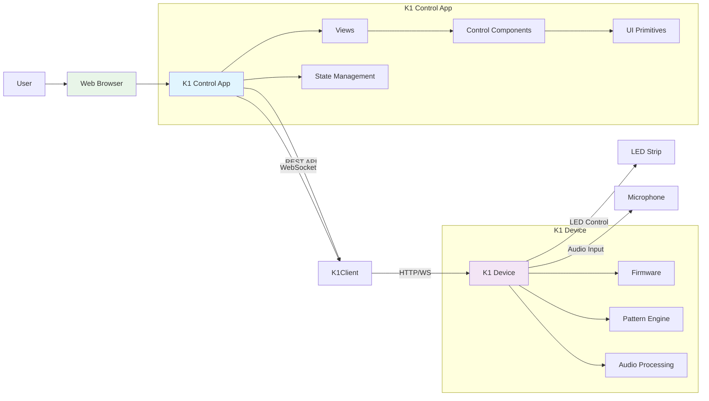

## Component Hierarchy

### Complete Component Tree

```mermaid
graph TD
    App[App.tsx<br/>Root Container] --> TopNav[TopNav.tsx<br/>Navigation Bar]
    App --> Sidebar[Sidebar.tsx<br/>Connection Panel]
    App --> MainView{Active View Router}
    App --> Toaster[ui/sonner.tsx<br/>Notifications]
    
    %% View Level
    MainView --> ControlPanel[ControlPanelView.tsx<br/>Main Control Interface]
    MainView --> Profiling[ProfilingView.tsx<br/>Performance Dashboard]
    MainView --> Terminal[TerminalView.tsx<br/>Debug Interface]
    
    %% Control Panel Components
    ControlPanel --> EffectSelector[EffectSelector.tsx<br/>Pattern Selection Grid]
    ControlPanel --> EffectParameters[EffectParameters.tsx<br/>Real-time Parameter Controls]
    ControlPanel --> ColorManagement[ColorManagement.tsx<br/>Palette & Color Controls]
    ControlPanel --> GlobalSettings[GlobalSettings.tsx<br/>Device-wide Settings]
    ControlPanel --> StatusBar[StatusBar.tsx<br/>Performance Metrics]
    
    %% Profiling Components
    Profiling --> ProfilingFilters[ProfilingFilters.tsx<br/>Data Filtering Controls]
    Profiling --> ProfilingCharts[ProfilingCharts.tsx<br/>Performance Visualization]
    Profiling --> LiveStatistics[LiveStatistics.tsx<br/>Real-time Metrics Table]
    
    %% UI Primitives (Key Examples)
    EffectSelector --> Card[ui/card.tsx]
    EffectSelector --> Badge[ui/badge.tsx]
    EffectParameters --> Slider[ui/slider.tsx]
    EffectParameters --> Button[ui/button.tsx]
    ColorManagement --> Select[ui/select.tsx]
    ProfilingCharts --> Chart[ui/chart.tsx]
    Sidebar --> Input[ui/input.tsx]
    
    %% Styling
    App --> GlobalCSS[index.css<br/>Global Styles]
    App --> TailwindCSS[Tailwind CSS v4]
    
    %% API Integration
    App --> K1Client[K1Client<br/>Device Communication]
    K1Client --> K1Types[k1-types.ts<br/>Type Definitions]
    K1Client --> K1Data[k1-data.ts<br/>Static Pattern Data]
    
    %% Color Coding
    style App fill:#e1f5fe
    style ControlPanel fill:#f3e5f5
    style Profiling fill:#e8f5e8
    style Terminal fill:#fff3e0
    style K1Client fill:#fce4ec
```

## Data Flow Diagrams

### Current Parameter Update Flow

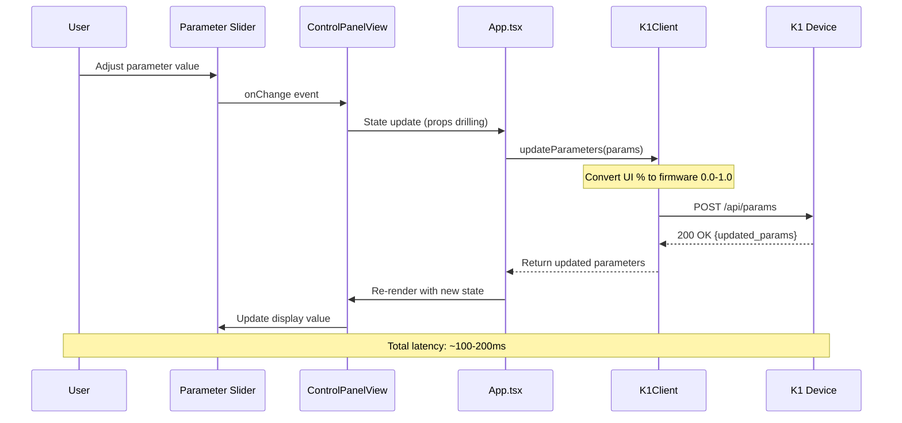

### Proposed Optimized Parameter Flow (Task 5)

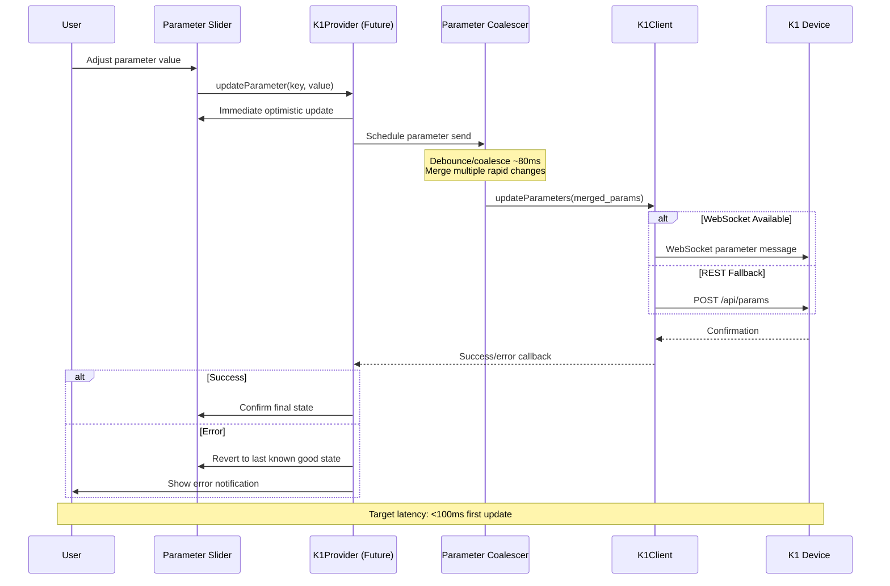

### Pattern Selection Flow

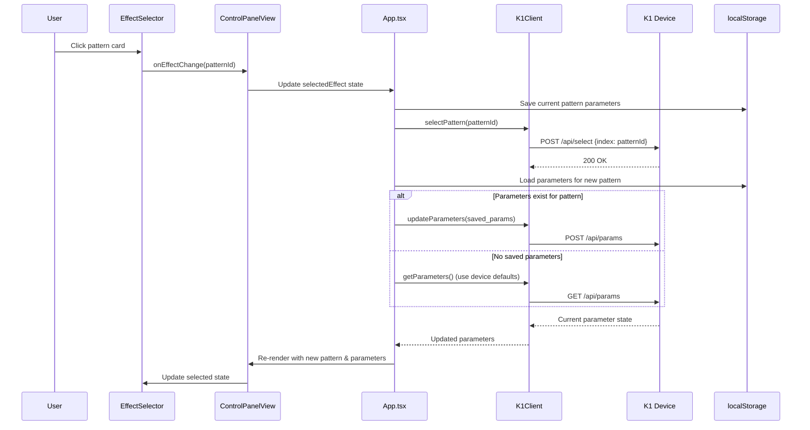

## Connection State Machine

### Connection Lifecycle

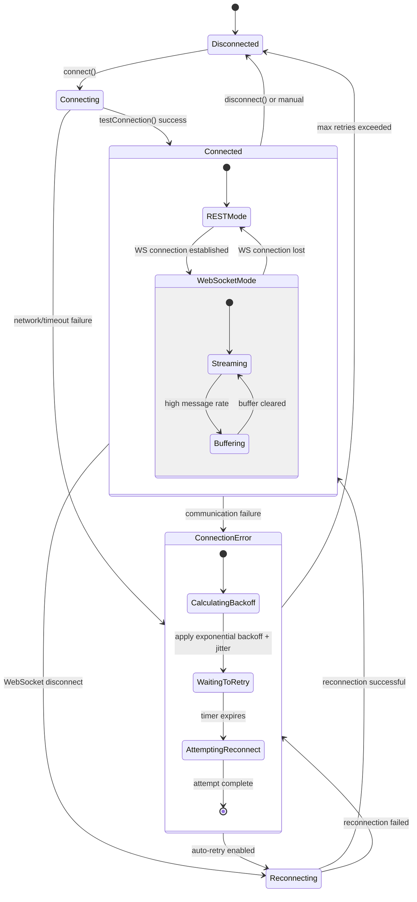

### Reconnection Backoff Strategy

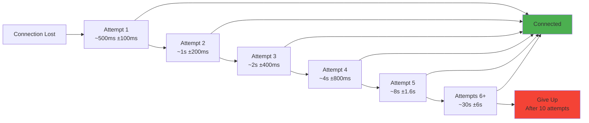

## Build Process Workflow

### Development Build Pipeline

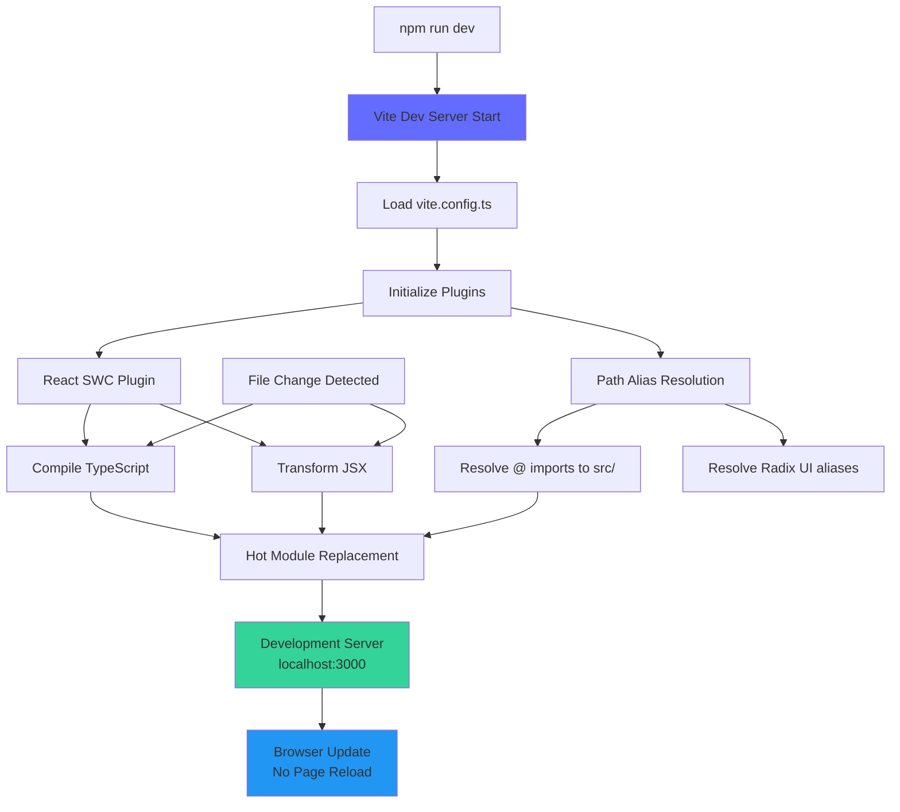

### Production Build Pipeline

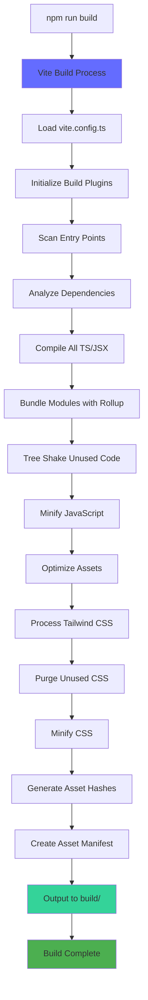

## Module Dependency Graph

### Core Module Dependencies

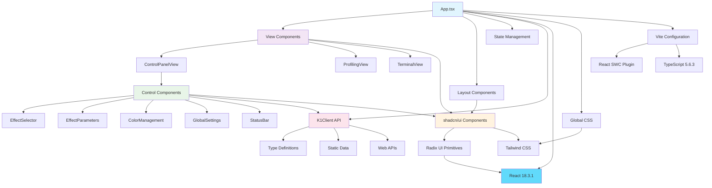

### Dependency Metrics

| Layer | Components | External Deps | Internal Deps |
|-------|------------|---------------|---------------|
| **Application** | 1 | React, Sonner | Views, Layout, API |
| **Views** | 3 | React | Controls, UI |
| **Controls** | 5 | React, Lucide | UI, API, Types |
| **UI Primitives** | 47 | Radix UI, CVA | Tailwind |
| **API** | 2 | Web APIs | Types |
| **Types** | 1 | None | None |

## Performance Flow Diagrams

### Real-time LED Visualization (Future - Task 7)

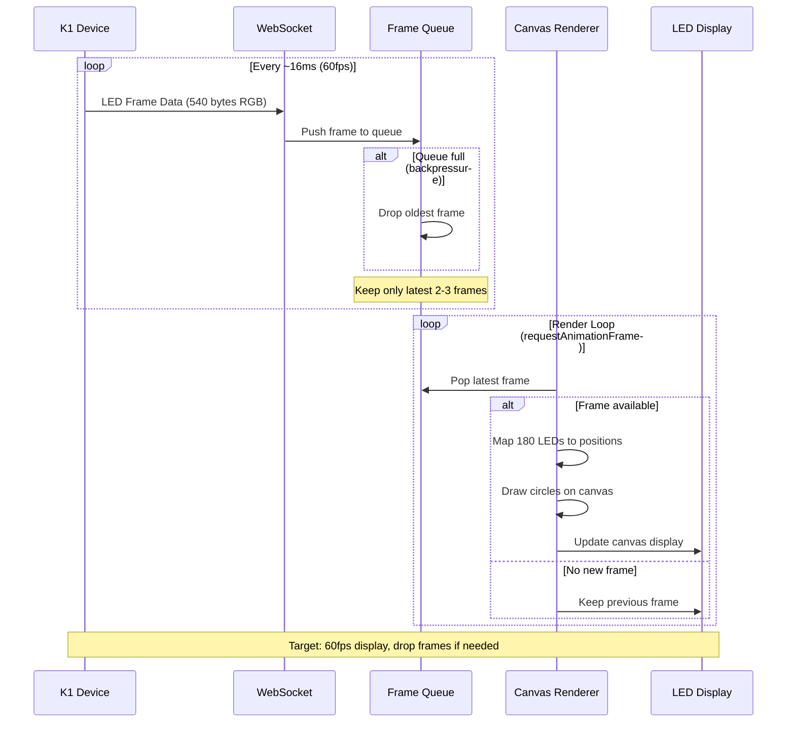

### Parameter Coalescing Strategy (Future - Task 5)

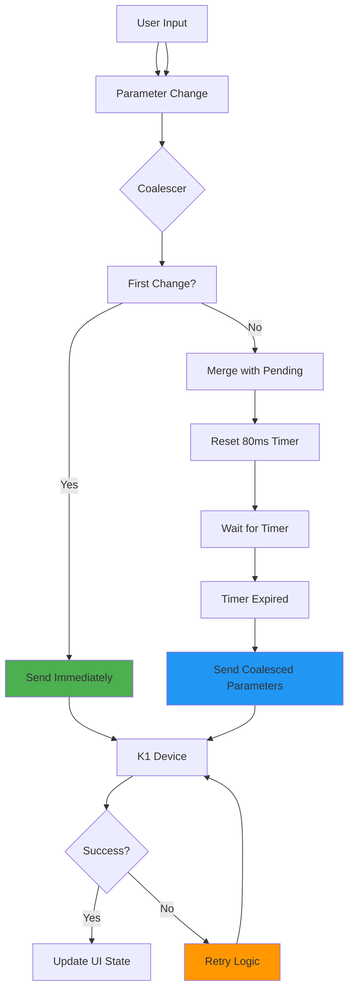

## Future Architecture Diagrams

### Proposed K1Provider Architecture (Task 2)

```mermaid
graph TD
    App[App.tsx] --> K1Provider[K1Provider Context]
    K1Provider --> K1State[Centralized State]
    K1Provider --> K1Client[K1Client Instance]
    
    K1State --> ConnectionState[Connection State]
    K1State --> DeviceInfo[Device Info]
    K1State --> PatternState[Pattern State]
    K1State --> ParameterState[Parameter State]
    K1State --> ErrorState[Error State]
    
    Components[All Components] --> useK1Hook[useK1() Hook]
    useK1Hook --> K1Provider
    
    K1Provider --> Persistence[localStorage Persistence]
    K1Provider --> Reconnection[Reconnection Logic]
    K1Provider --> ErrorHandling[Error Boundaries]
    
    style K1Provider fill:#e1f5fe
    style K1State fill:#f3e5f5
    style useK1Hook fill:#e8f5e8
```

## Diagram Maintenance

### Keeping Diagrams Current

1. **Component Changes**: Update component hierarchy when adding/removing components
2. **API Changes**: Update data flow diagrams when API contracts change
3. **State Changes**: Update state diagrams when state management evolves
4. **Build Changes**: Update build diagrams when tooling changes

### Diagram Validation

- **Quarterly Review**: Verify all diagrams match current implementation
- **PR Reviews**: Update diagrams when architecture changes
- **Documentation Sync**: Ensure diagrams align with written documentation

### Mermaid Syntax Reference

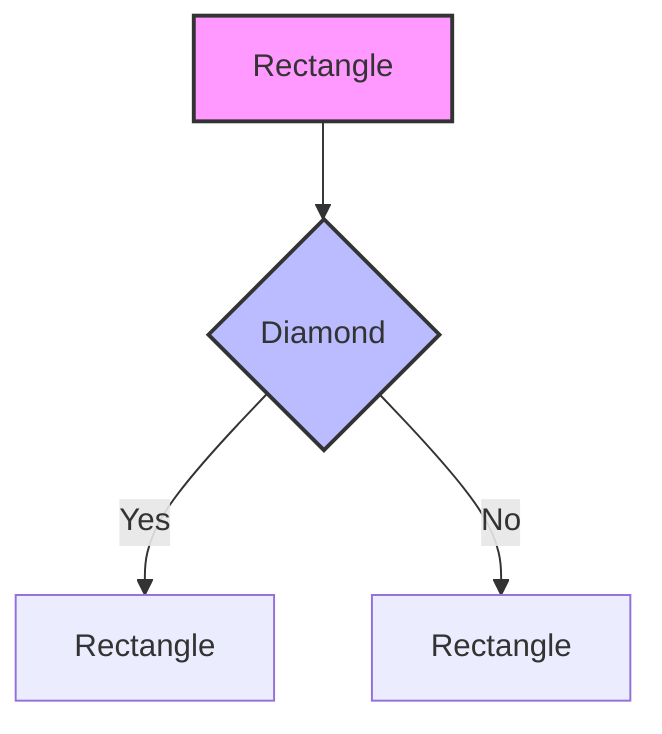

## Cross-References

- [Component Hierarchy](./COMPONENT_HIERARCHY.md) - Detailed component relationships
- [State and Data Flow](./STATE_AND_DATA_FLOW.md) - State management patterns
- [K1 Integration](./K1_INTEGRATION.md) - API communication details
- [Build Pipeline](./BUILD_PIPELINE.md) - Build process configuration