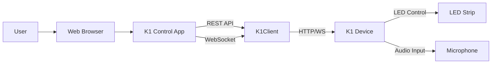

# K1 Control App - Architecture Overview

## Purpose and Scope

The K1 Control App is a React-based web application that provides a professional interface for controlling K1.reinvented LED devices. This application serves as the primary user interface for pattern selection, parameter adjustment, real-time visualization, and device management.

### Goals
- Provide intuitive control over K1 LED patterns and parameters
- Enable real-time visualization of LED output
- Support audio-reactive pattern configuration
- Offer comprehensive device monitoring and profiling
- Maintain responsive performance with <100ms parameter updates

### Non-Goals
- Direct firmware development or embedded programming
- Hardware design or LED strip configuration
- Audio processing (handled by device firmware)
- Multi-device orchestration (single device focus)

## Technology Stack Summary

| Component | Technology | Version | Purpose |
|-----------|------------|---------|---------|
| **Framework** | React | 18.3.1 | UI framework with hooks and functional components |
| **Language** | TypeScript | 5.6.3 | Type safety and developer experience |
| **Build Tool** | Vite | 6.4.1 | Fast development server and optimized builds |
| **Compiler** | SWC | via @vitejs/plugin-react-swc | Fast TypeScript/JSX compilation |
| **Styling** | Tailwind CSS | v4 | Utility-first CSS framework |
| **UI Library** | Radix UI + shadcn/ui | Latest | Accessible headless components |
| **Icons** | Lucide React | 0.487.0 | Consistent icon system |
| **Charts** | Recharts | 2.15.2 | Data visualization for profiling |
| **Notifications** | Sonner | 2.0.3 | Toast notifications |

## System Context

### Data Flow
1. **User Interaction** → React components update local state
2. **Parameter Changes** → Debounced/coalesced via K1Client
3. **REST/WebSocket** → Communication with K1 device firmware
4. **Real-time Updates** → WebSocket streams for LED visualization
5. **Audio Processing** → Device handles audio analysis and pattern generation

## Architecture Principles

### Performance First
- Parameter updates target <100ms latency
- Real-time LED visualization at 60fps
- Debounced parameter coalescing to reduce network chatter
- Efficient React rendering with memoization

### Resilient Connectivity
- Exponential backoff reconnection strategy
- WebSocket primary, REST fallback
- Graceful degradation when device unavailable
- Connection state management with user feedback

### Developer Experience
- TypeScript for type safety
- Component-based architecture
- Clear separation of concerns
- Comprehensive error handling

## Current vs Planned Architecture

### Current State (As Implemented)
- Local state management via React useState
- Props drilling for shared state
- Direct K1Client instantiation in App.tsx
- Manual connection management

### Planned Improvements (Referenced in Tasks 2-10)
- Centralized K1Provider with useK1 hook
- Exponential backoff with jitter
- Per-pattern parameter persistence
- Comprehensive error boundaries
- Testing infrastructure
- Performance monitoring

## Related Documentation

- [Project Structure](./PROJECT_STRUCTURE.md) - Directory organization and file purposes
- [Build Pipeline](./BUILD_PIPELINE.md) - Vite configuration and build process
- [Component Hierarchy](./COMPONENT_HIERARCHY.md) - React component organization
- [K1 Integration](./K1_INTEGRATION.md) - Device API and communication
- [Development Workflows](./DEVELOPMENT_WORKFLOWS.md) - Setup and development processes
- [Quality Playbook](./QUALITY_PLAYBOOK.md) - Testing and code quality standards

## External References

- [K1 Firmware API](../../api/K1_FIRMWARE_API.md) - Complete API reference
- [Development Guide](../../../k1-control-app/DEVELOPMENT.md) - Setup instructions
- [Design Specifications](../../../k1-control-app/src/DESIGN_SPECS.md) - UI/UX guidelines