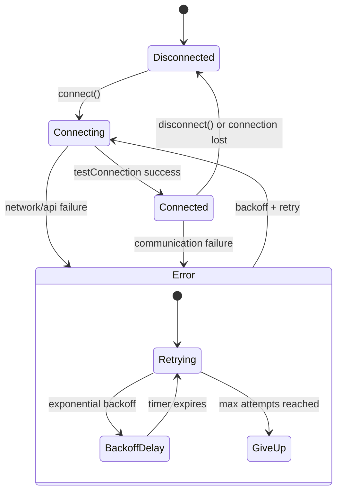
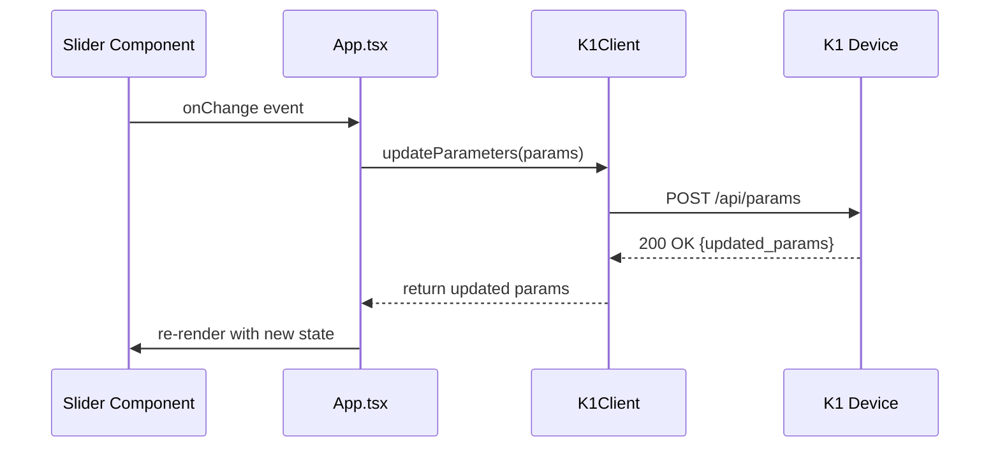
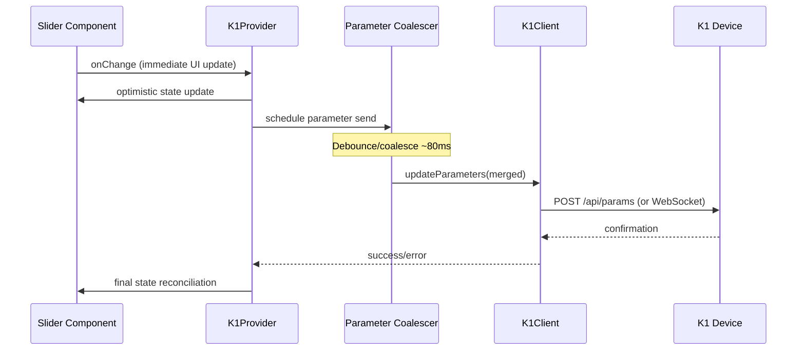

# K1 Control App - State Management and Data Flow

## Current State Architecture

### Local State Management (App.tsx)

The application currently uses React's built-in `useState` hooks for state management, with all shared state managed in the root `App.tsx` component:

```typescript
// Current state in App.tsx (lines 13-17)
const [activeView, setActiveView] = useState<ViewType>('control');
const [connectionStatus, setConnectionStatus] = useState<ConnectionStatus>('disconnected');
const [connectionIP, setConnectionIP] = useState('192.168.1.100');
const [k1Client, setK1Client] = useState<K1Client | null>(null);
```

### State Distribution Pattern
- **Props Drilling**: State passed down through component hierarchy
- **No External Store**: No Redux, Zustand, or Context providers
- **Local Component State**: Individual components manage their own UI state

## Proposed State Architecture (Task 2)

### Centralized K1Provider Pattern

```typescript
interface K1State {
  // Connection Management
  connectionStatus: ConnectionStatus;
  deviceInfo: K1DeviceInfo | null;
  lastError: K1Error | null;
  
  // Pattern and Parameters
  selectedPatternId: number;
  parameters: K1Parameters;
  activePaletteId: number;
  
  // Real-time Data
  audioData: K1AudioData | null;
  performanceData: K1PerformanceData | null;
  
  // Transport and Reconnection
  transport: 'ws' | 'rest';
  reconnectAttempt: number;
  wsUnavailable: boolean;
}
```

### Provider Implementation
```typescript
const K1Provider: React.FC<{ children: React.ReactNode }> = ({ children }) => {
  const [state, dispatch] = useReducer(k1Reducer, initialState);
  const k1ClientRef = useRef<K1Client | null>(null);
  
  // Provider methods
  const connect = useCallback(async (endpoint?: string) => { /* ... */ }, []);
  const disconnect = useCallback(() => { /* ... */ }, []);
  const selectPattern = useCallback((id: number) => { /* ... */ }, []);
  const updateParameters = useCallback((params: Partial<K1ParameterUI>) => { /* ... */ }, []);
  
  return (
    <K1Context.Provider value={{ state, connect, disconnect, selectPattern, updateParameters }}>
      {children}
    </K1Context.Provider>
  );
};
```

## Connection Lifecycle and State Machine

### Connection States



### Reconnection Strategy with Exponential Backoff

```typescript
interface ReconnectionConfig {
  baseDelay: number;        // 500ms initial delay
  maxDelay: number;         // 30s maximum delay
  maxAttempts: number;      // 10 attempts before giving up
  jitterFactor: number;     // ±20% randomization
}

const calculateBackoffDelay = (attempt: number, config: ReconnectionConfig): number => {
  const exponentialDelay = Math.min(
    config.baseDelay * Math.pow(2, attempt),
    config.maxDelay
  );
  
  // Add jitter to prevent thundering herd
  const jitter = exponentialDelay * config.jitterFactor * (Math.random() - 0.5);
  return Math.max(0, exponentialDelay + jitter);
};
```

**Backoff Schedule**:
- Attempt 1: ~500ms (±100ms jitter)
- Attempt 2: ~1s (±200ms jitter)
- Attempt 3: ~2s (±400ms jitter)
- Attempt 4: ~4s (±800ms jitter)
- Attempt 5: ~8s (±1.6s jitter)
- Attempts 6+: ~30s (±6s jitter)

## Parameter Update Flow

### Current Implementation


### Proposed Optimized Flow (Task 5)


### Parameter Coalescing Strategy

```typescript
interface ParameterCoalescer {
  pendingParams: Partial<K1ParameterUI>;
  timeoutId: NodeJS.Timeout | null;
  
  scheduleUpdate(params: Partial<K1ParameterUI>): void;
  flush(): Promise<void>;
  cancel(): void;
}

const useParameterCoalescer = (sendFn: (params: Partial<K1ParameterUI>) => Promise<void>) => {
  const coalescerRef = useRef<ParameterCoalescer>({
    pendingParams: {},
    timeoutId: null,
    
    scheduleUpdate(params) {
      // Merge with pending parameters
      this.pendingParams = { ...this.pendingParams, ...params };
      
      // Clear existing timeout
      if (this.timeoutId) {
        clearTimeout(this.timeoutId);
      }
      
      // Schedule coalesced send
      this.timeoutId = setTimeout(() => {
        this.flush();
      }, 80); // 80ms debounce
    },
    
    async flush() {
      if (Object.keys(this.pendingParams).length > 0) {
        const paramsToSend = { ...this.pendingParams };
        this.pendingParams = {};
        this.timeoutId = null;
        
        try {
          await sendFn(paramsToSend);
        } catch (error) {
          console.error('Parameter update failed:', error);
        }
      }
    }
  });
  
  return coalescerRef.current;
};
```

## Per-Pattern Parameter Persistence

### Storage Strategy
```typescript
interface ParameterPersistence {
  // Storage keys
  getStorageKey(patternId: number): string;
  
  // Persistence operations
  saveParameters(patternId: number, params: K1ParameterUI): void;
  loadParameters(patternId: number): K1ParameterUI | null;
  clearParameters(patternId: number): void;
  
  // Bulk operations
  exportAllParameters(): Record<number, K1ParameterUI>;
  importParameters(data: Record<number, K1ParameterUI>): void;
}

const useParameterPersistence = (): ParameterPersistence => {
  return {
    getStorageKey: (patternId: number) => `k1:params:pattern:${patternId}`,
    
    saveParameters: (patternId: number, params: K1ParameterUI) => {
      const key = `k1:params:pattern:${patternId}`;
      localStorage.setItem(key, JSON.stringify(params));
    },
    
    loadParameters: (patternId: number) => {
      const key = `k1:params:pattern:${patternId}`;
      const stored = localStorage.getItem(key);
      return stored ? JSON.parse(stored) : null;
    },
    
    // ... other methods
  };
};
```

### Pattern Switch Behavior
1. **Save Current**: Persist current parameters for active pattern
2. **Load New**: Retrieve saved parameters for selected pattern
3. **Apply Defaults**: Use default parameters if none saved
4. **Update Device**: Send parameters to device
5. **Update UI**: Reflect new parameters in controls

## Transport Layer Strategy

### WebSocket Primary, REST Fallback

```typescript
interface TransportRouter {
  preferredTransport: 'ws' | 'rest';
  wsAvailable: boolean;
  
  async sendParameters(params: Partial<K1ParameterUI>): Promise<K1Parameters>;
  async selectPattern(id: number): Promise<void>;
  async getDeviceInfo(): Promise<K1DeviceInfo>;
}

const useTransportRouter = (k1Client: K1Client): TransportRouter => {
  const [wsAvailable, setWsAvailable] = useState(false);
  
  const sendParameters = async (params: Partial<K1ParameterUI>) => {
    if (wsAvailable && k1Client.isWebSocketConnected()) {
      // Use WebSocket for real-time updates
      return k1Client.sendParametersWS(params);
    } else {
      // Fallback to REST API
      return k1Client.updateParameters(params);
    }
  };
  
  return {
    preferredTransport: wsAvailable ? 'ws' : 'rest',
    wsAvailable,
    sendParameters,
    // ... other methods
  };
};
```

### Feature Flags for Transport Control
```typescript
interface TransportFeatureFlags {
  enableWebSocket: boolean;
  enableRestFallback: boolean;
  enableParameterCoalescing: boolean;
  enablePersistence: boolean;
}

const defaultFeatureFlags: TransportFeatureFlags = {
  enableWebSocket: true,
  enableRestFallback: true,
  enableParameterCoalescing: true,
  enablePersistence: true,
};
```

## Error Handling and Recovery

### Error Classification
```typescript
type K1ErrorType = 
  | 'connection_failed'
  | 'timeout'
  | 'invalid_response'
  | 'parameter_validation'
  | 'websocket_error'
  | 'unknown_error';

interface K1Error {
  type: K1ErrorType;
  message: string;
  timestamp: number;
  context?: Record<string, any>;
  recoverable: boolean;
}
```

### Recovery Strategies
- **Connection Errors**: Exponential backoff reconnection
- **Parameter Errors**: Revert to last known good state
- **WebSocket Errors**: Fallback to REST transport
- **Timeout Errors**: Retry with increased timeout
- **Validation Errors**: Show user feedback, don't retry

## Performance Considerations

### State Update Optimization
- **Memoization**: Use `useMemo` for expensive computations
- **Callback Stability**: Use `useCallback` for event handlers
- **Selective Updates**: Only update components that need re-rendering

### Memory Management
- **Cleanup**: Remove event listeners and timers on unmount
- **Buffer Limits**: Limit size of audio/performance data buffers
- **Garbage Collection**: Avoid creating objects in render loops

## Migration Path from Current State

### Phase 1: Introduce K1Provider
1. Create K1Provider with current state structure
2. Wrap App.tsx with provider
3. Migrate connection logic to provider
4. Update components to use useK1 hook

### Phase 2: Add Reconnection Logic
1. Implement exponential backoff
2. Add connection state machine
3. Handle WebSocket reconnection
4. Add error boundaries

### Phase 3: Optimize Parameter Flow
1. Add parameter coalescing
2. Implement per-pattern persistence
3. Add transport routing
4. Performance monitoring

## Cross-References

- [Component Hierarchy](./COMPONENT_HIERARCHY.md) - How state flows through components
- [K1 Integration](./K1_INTEGRATION.md) - API communication details
- [Quality Playbook](./QUALITY_PLAYBOOK.md) - Testing state management logic